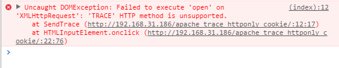
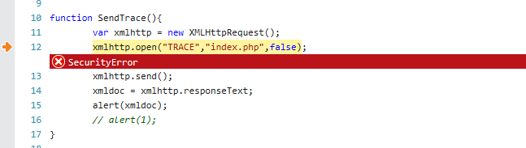

## 目的

想利用 开启 Trace 方法的 Apache 服务器,结合XSS漏洞 拿到 http-only 的 Cookie.

## 开启 Trece

Apache2最近版本默认不开启 Trace 方法,需要手动设置启用.

	vim /etc/apache2/apache2.conf

追加:

	TraceEnable on

## 测试 Trace 方法

	http TRACE 127.0.0.1

输出如下表示已经开启 Trace 方法:

	anka9080@EvilCLAY:~$ http TRACE 127.0.0.1
	HTTP/1.1 200 OK
	Connection: Keep-Alive
	Content-Type: message/http
	Date: Sat, 08 Apr 2017 08:19:44 GMT
	Keep-Alive: timeout=5, max=100
	Server: Apache/2.4.18 (Ubuntu)
	Transfer-Encoding: chunked

	TRACE / HTTP/1.1
	Host: 127.0.0.1
	Connection: keep-alive
	Accept-Encoding: gzip, deflate
	Accept: */*
	User-Agent: HTTPie/0.9.6
	Content-Length: 0

## 测试结果

老Bug了,在IE6下可以使用 ActiveXObject("Microsoft.XMLHTTP")  方法来搞,

较新版本的 Firefox Chrome IE 浏览器已经不支持 XMLHttpRequest 的 Trace 方法,
测试失败.

失败截图如下:

Chrome:

IE:

